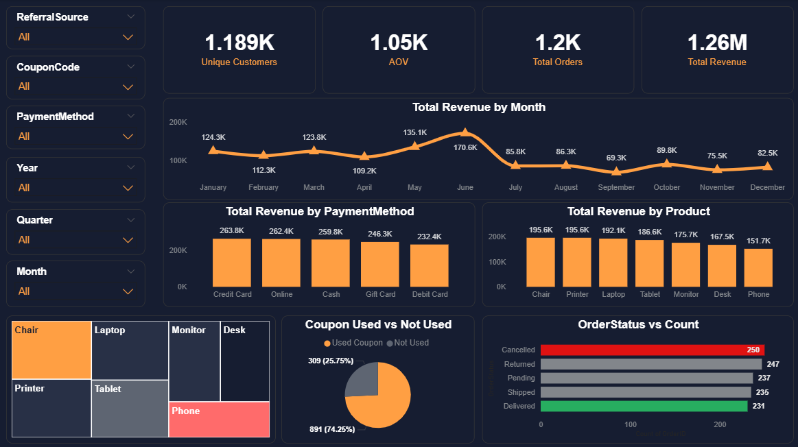

# 📊 Sales Data Analysis Project

## 📌 Overview

This project focuses on analyzing a real-world sales dataset to extract actionable business insights related to customer behavior, product performance, and revenue trends.

The analysis was performed using **Python (Pandas)** for data processing and **SQL Server** for querying and validation.

---

## 🎯 Objectives

* Perform data cleaning and validation (ETL process)
* Conduct exploratory data analysis (EDA)
* Identify trends, patterns, and outliers
* Generate business insights to support decision-making

---

## 🛠️ Tools & Technologies

* Python (Pandas, Matplotlib, Seaborn)
* SQL Server
* Excel

---

## 📂 Dataset Description

The dataset contains sales transaction data with the following key columns:

* OrderID, Date, CustomerID
* Product, Quantity, UnitPrice, TotalPrice
* PaymentMethod, OrderStatus
* CouponCode, ReferralSource
* ItemsInCart, ShippingAddress

---

## 🧹 Data Cleaning

* Converted **Date** column to proper datetime format
* Handled missing values in **CouponCode** by replacing them with `"No Coupon"`
* Verified data integrity:

  * No duplicate rows
  * No duplicate OrderIDs
  
   
  * No missing values after cleaning
 
    
---

## 📊 Exploratory Data Analysis (EDA)

### ✔️ Statistical Analysis

* Calculated **mean, median, and count**
* Identified distribution patterns across:

  * Quantity
  * UnitPrice
  * TotalPrice

---

### ⚠️ Outlier Detection

* Applied **IQR method** to detect outliers in `TotalPrice`
* Identified **8 high-value transactions**
* These outliers significantly impact the average revenue and represent bulk or premium purchases

 
---

### 📈 Trends Analysis

* Analyzed **monthly sales performance**
* Identified peak and low sales periods
* Observed potential **seasonal patterns**

 
---

## 📌 Key Business Insights

* Sales peak in **June**, while the lowest performance occurs in **September**, indicating seasonal demand variation
* A small number of high-value transactions significantly impact total revenue
* Certain products generate higher revenue despite lower sales volume (high-value products)
* Top customers contribute disproportionately to total revenue (VIP behavior)
* Coupon usage has a strong impact on total sales volume
* Payment methods are evenly distributed, indicating flexible customer preferences
* Order status distribution suggests potential operational issues (high cancellations)

---

## 🧠 SQL Analysis

* Used SQL queries to validate and extend analysis:

  * `SUM()` → revenue calculations
  * `COUNT()` → frequency analysis
  * `AVG()` → average metrics
  * `GROUP BY` → segmentation
  * `ORDER BY` → ranking


---

## 📊 Key Metrics (KPIs)

- **Total Revenue**
- **Total Orders**
- **Average Order Value (AOV)**
- **Unique Customers**

---

## 📊 Data Visualization

An interactive dashboard was built using Power BI to transform analytical findings into clear business insights.

Key Highlights:
- Peak sales occur in June (seasonality impact)
- High-value orders significantly influence revenue
- Product performance differs between volume and value
- Coupons contribute to higher overall sales
- Detected high cancellation rate **(~20%)**

---

## 📊 Dashboard Features
- Drill Through Analysis  
- Dynamic Tooltips  
- Interactive Metric Switching (Field Parameters)  
- Business KPIs (Revenue, AOV, Trends)

---

📊 Dashboard Preview!




## Project Structure

```bash
.
├── data/
│   └── Dataset.xlsx
├── python/
│   └── analysis.py
├── sql/
│   └── analysis.sql
├── report/
│   └── insights.txt
│   Proofs/
│   Dashboard.png
└── README.md
```

---

## Link post on LinkedIN :

https://www.linkedin.com/feed/update/urn:li:activity:7454539398592917505/

---

## Conclusion

This project demonstrates the ability to clean, analyze, and extract meaningful insights from raw data using Python and SQL.

It highlights how data analysis can support business decisions by identifying trends, customer behavior, and revenue drivers.

---

## Author

**Ahmad Balata**

Data Analyst | Excel | Python | SQL | Power BI
